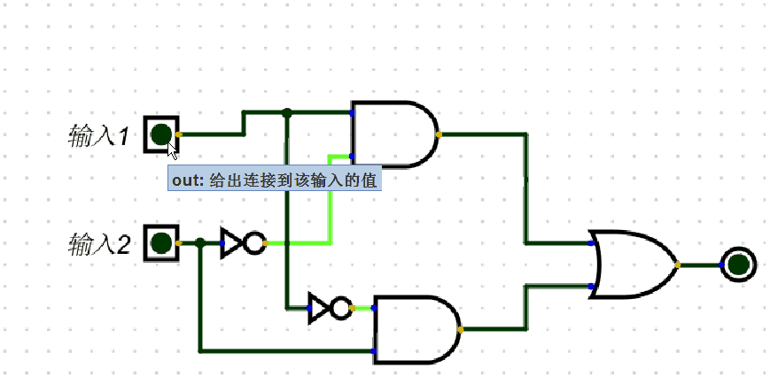

|输入1|输入2|结果|进位|
|-|-|-| -
|0|0|0|0| 
|1|0|1|0|
|0|1|1|0|
|1|1|0|1|

## 半加器: 实现1位的加法
+ 根据结果可知输入1与输入2相加
+ 结果 -> 符合 异或门
+ 进位 -> 符合 与门
+ 最终要么有结果要么有进位,不存在即有结果也有进位

### 异或门的实现也可以由基本的3个 "与或非" 门实现
+ 与:& , 或:| , 非:! 用这3个符号表示
+ 假设输入1:x, 输入2:y
+ 可以得出真值表达式(仅有1的结果):
+ sum = x&!y + !x&y => x与非Y + 非x与Y
+ 中间的 + 号是各种可能性的意思,也就是或门

# 异或门的实现

# 半加器

