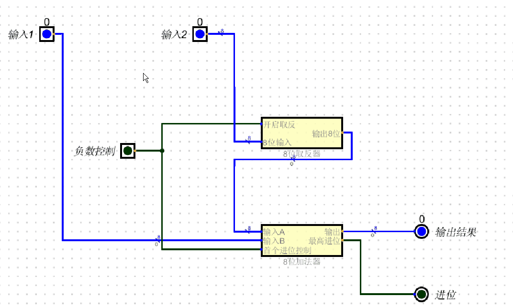
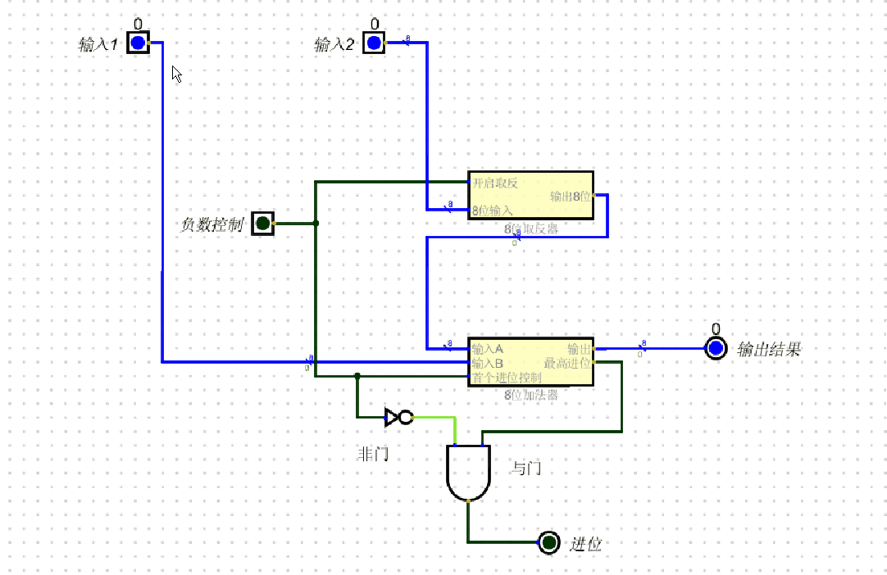

# 加减法
+ 这是一个有问题的加减法
+ 根据8位加法和8位取反可以组合成一个加减法
+ 减法相当于 加一个负数,而负数可以用取反+1的补码来表示
+ 现在的问题是如何解决+1的问题, 目前只有一个取反控制器 ?
+ 加法器中有个“首个进位控制" , 可以用来+1操作,只需要把 " 首个进位控制" 跟 取反器的“开启取反” 用同一个控制线连接即可
+ 根据下面可以看到2个数相加没问题,一旦相减,最后的进位还是存在问题, 原因在于 补码+正数 后的进位

## 解决方式
+ 解决方案是如果没开负数,进位保持原样
+ 如果开了负数,则忽略进位
+ 根据下面可知只有当不开负数且有进位时,才保留进位
+ 因此可以在 "负数控制" 线添加一个非门,跟进位进行与操作
+ 表达式:最终进位= !负数控制 & 进位
### 真值表
|负数控制|进位|最终进位结果|
|-|-|-|
|0|0|0|
|0|1|1|
|1|0|0|
|1|1|0|

