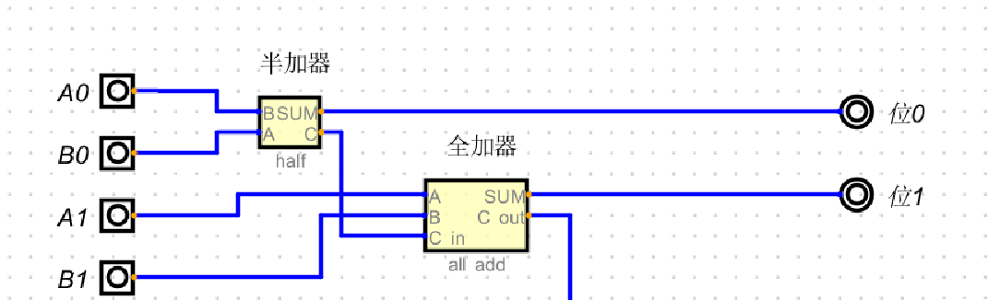
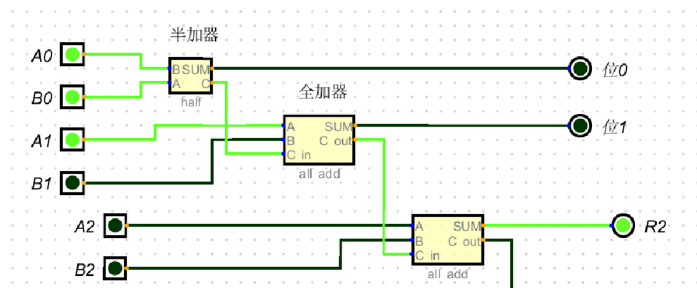

1.半加器

2.全加器


```
半加器: 完整模拟1位加法
1.A,B 接受端,接受1或0 , 2个电信号
2.异或门 做为结果: 1^1=0, 0^0=0, 1^0=1, 0^1=1 与编程中的: 异或一致
3.与门   做为进位: 1&1=1,1&0=0,0&1=0, 0&0=1 与编程中的: 与一致
4.半加器实现1位的加法运算,比如:
  A端:                               1          1         
  B端:                            +  1          0
                                  -----       ----
                            (进位)1  0          1
5:根据异或门:输出结果, 与门:输出进位; 因此只能计算1位的半加器输出的结果要么1,要么0

全加器:
1. 使用2个半加器组成, 能处理1个进位
2. 1个半加器只能处理1位加法, 2个组合就能处理进位问题,把第一个半加器输出的进位当成输入
3. 每个半加器做1位加法
  3.1
      把A,B端进行相加,A,B端都为1时,有进位, 此时C in(上一次的进位)即为结果
  3.2
      若A,B只有1个为1, 此时下面半加器进位C=0, sum输出结果到第二个半加器与C in相加, 再一次做1位加法
4.全加器本身也只能处理1位加法, 多了能处理一个进位
```

3.一个半加器+ 一个全加器

```
  1. 半加器 +　全加器　可以计算2位加法, 因为全加器可以处理1个进位
  2. 半加器输出1位进位,把进位作为输出到全加器的C in

  比如: A0=1, B0=1, A1=1, B1=0 ,对应下面的图
          
           A1  A0                1   1
           B1  B0             +  0   1
                          --------------
                  (进位舍去)1    0   0
```

