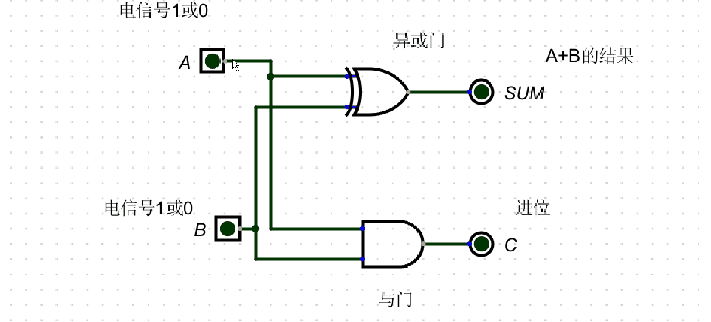

1.半加器

2.全加器

`
半加器: 完整模拟1位加法
1.A,B 接受端,接受1或0 , 2个电信号
2.异或门 做为结果: 1^1=0, 0^0=0, 1^0=1, 0^1=1 与编程中的: 异或一致
3.与门   做为进位: 1&1=1,1&0=0,0&1=0, 0&0=1 与编程中的: 与一致
4.半加器实现1位的加法运算,比如:
  A端:                               1          1         
  B端:                            +  1          0
                                  -----       ----
                            (进位)1  0          1
5:根据异或门:输出结果, 与门:输出进位; 因此只能计算1位的半加器输出的结果要么1,要么0

全加器:
1.使用2个半加器组成
2.1个半加器只能处理1位加法, 2个组合就能处理2位加法,把第一个半加器输出的进位当成输入
3.
  3.1把A,B端进行相加,只有A,B端都为1时,才有进位, 此时C in(上一次的进位)即为结果
  3.2若A,B只有1个为1, 此时下面的半加器C=0, 输出结果到第二个半加器与C in相加
`
          
