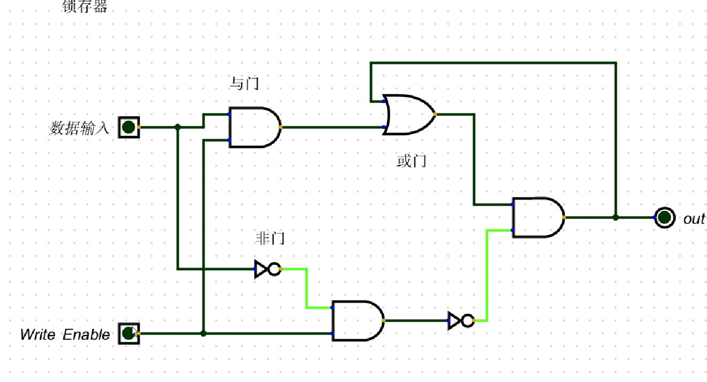
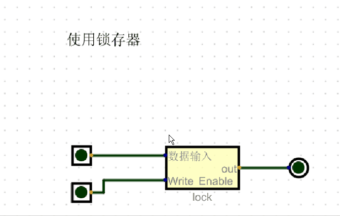
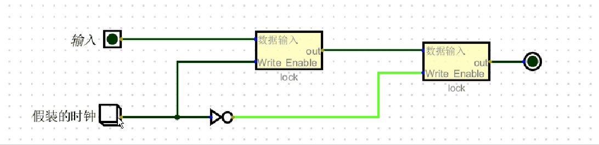
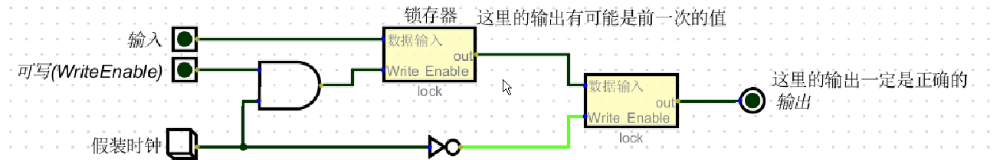
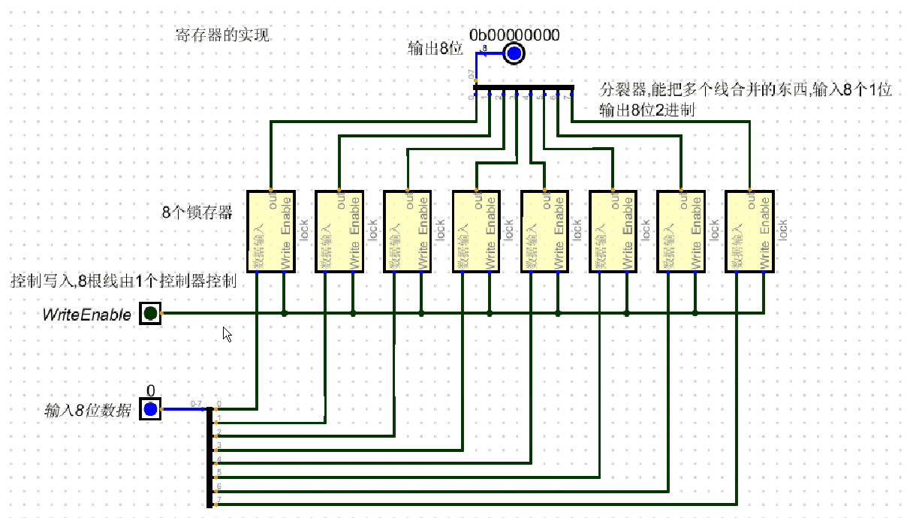

# 锁存器,用于存储1位的电路
### 只有当 可写位(write enable)开启,才会把输入写到输出,同时保存输出

# 使用锁存器

# 带时钟的锁存器

# 带时钟带可写控制的完整版锁存器
+ 下面的时钟使用按钮来代替, 只有按钮为1时,相连的电路才工作
+ 时钟的作用在于协同所有电路共同工作,也是一切电路自动化的源头
+ 更多关于时钟的解释在 3.1 内部数据总线与时钟 中

# 1个8位的简易版寄存器可由8个锁存器组成

