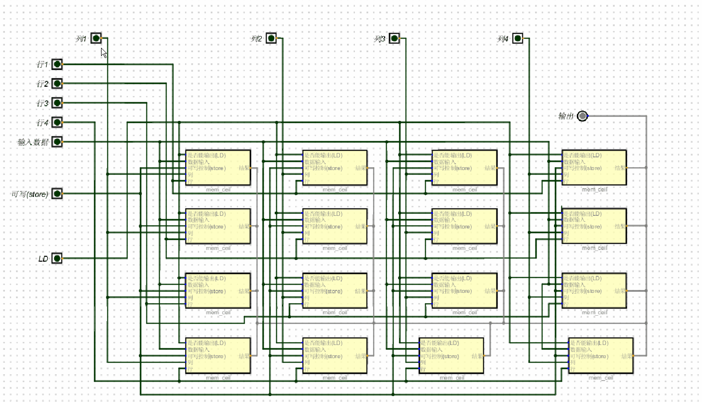

# 1位的内存单元
+ 对于一个内存单元需要有:
+ 1个锁存器,数据输入,可写控制,是否读取(也是是否输出), 行和列(内存地址), 数据输出这几部分组成
+ 写入: 当行和列, 数据输入,可写全为1时则写入,(行 & 列 & 输入 & 可写)
+ 读出(输出): 当 行,列, 是否读取(也是是否输出)  ( 行 & 列 & 读取)


# 16位的内存单元
+ 根据上面1位的内存单元可组合成一个16位内存单元
+ 数据输入,可写控制,读取控制(输出控制),输出. 可由4根线连接(每根线与16个内存单元连接)
+ 由于每根线与16个内存单元连接,因此每次点亮(给电信号),16个内存单元会全部收到
+ 最终通过 行 , 列 来区分 写入或读取哪个内存单元
+ 例如:给2行2列写入:
```
1. 点亮第2行, 第2行4个内存单元将全部选中
2. 点亮第2列, 第2列4个内存单元全部选中
3. 但能符合条件的,即 “行 & 列 & 写入控制 &输入数据” 这4个条件的只有 第二行第二列
```

