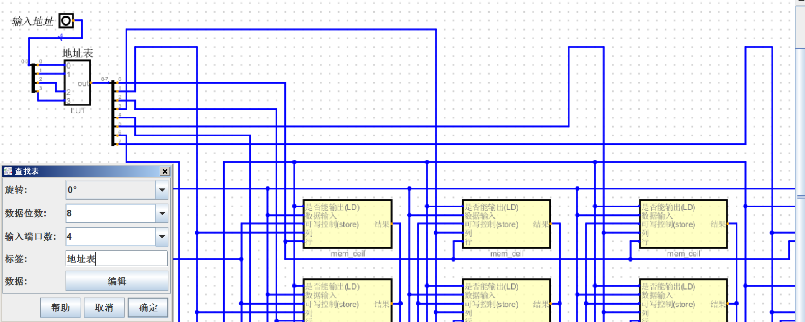
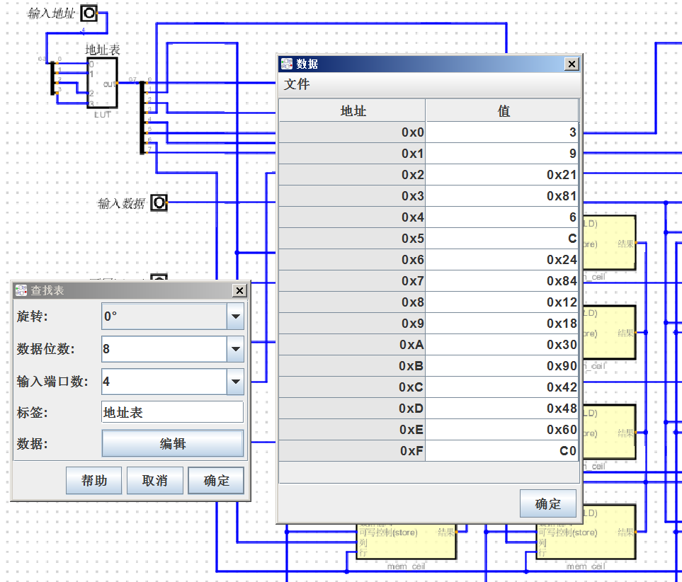
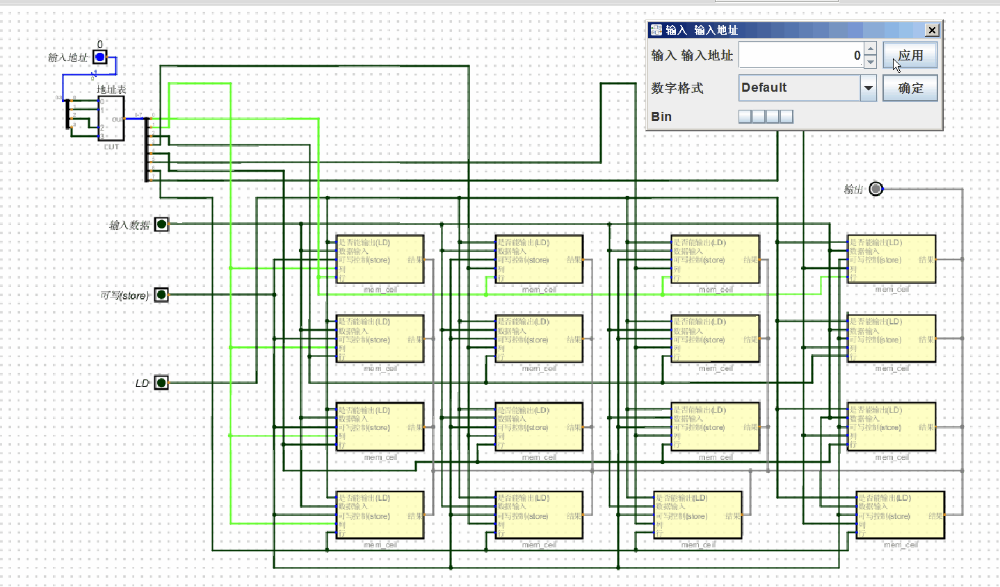

# 1位的内存单元
+ 对于一个内存单元需要有:
+ 1个锁存器,数据输入,可写控制,是否读取(也是是否输出), 行和列(内存地址), 数据输出这几部分组成
+ 写入: 当行和列, 数据输入,可写全为1时则写入,(行 & 列 & 输入 & 可写)
+ 读出(输出): 当 行,列, 是否读取(也是是否输出)  ( 行 & 列 & 读取)


# 内存单元16位
+ 根据上面1位的内存单元可组合成一个16位内存单元
+ 内存是一种串行
+ 数据输入,可写控制,读取控制(输出控制),输出. 可由4根线连接(每根线与16个内存单元连接)
+ 由于每根线与16个内存单元连接,因此每次点亮(给电信号),16个内存单元会全部收到
+ 最终通过 行 , 列 来区分 写入或读取哪个内存单元
+ 例如:给2行2列写入:
```
1. 点亮第2行, 第2行4个内存单元将全部选中
2. 点亮第2列, 第2列4个内存单元全部选中
3. 但能符合条件的,即 “行 & 列 & 写入控制 &输入数据” 这4个条件的只有 第二行第二列
```
+ 与寄存器不同, 寄存器每根线独立,并行操作. 内存串行,一根数据线控制所有单元,一根地址线控制一列或一行内存单元


# 16位内存单元对 地址线的修改
+ 由于上面一共16个地址, 因此2的4次方 => 2^4 就可以表示
+ 下面替换的地址线,通过一个查找表来实现
+ 原行1 连接到 位0 , 原列1->位1,原行2->位2,原列2->位3.. 以此类推

+ 以行3举例(2进制):
+ 行3连接到的是位4:10000, 列1连接到的是位1:10
+ 因此 行3列1 的内存单元 对应的值是:10010
+ 总之,根据 行,列 对应连接的位来计算此内存单元的值

+ 下面给出行3,行4对应的值(2进制):
+ 行3:
+ 列1:10010
+ 列2:11000
+ 列3:110000
+ 列4:10010000

+ 行4:
+ 列1:1000010  (行4连连接到是位6, 列1连接到的是位1)
+ 列2:1001000
+ 列3:1100000
+ 列4:11000000

## 下面地址表中显示的是16进制



## 16位内存单元地址示例

