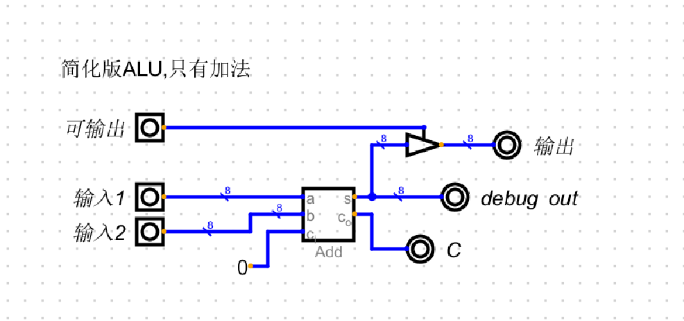
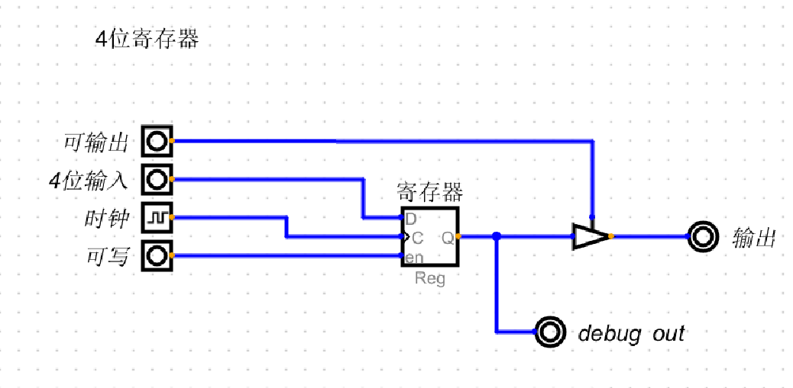
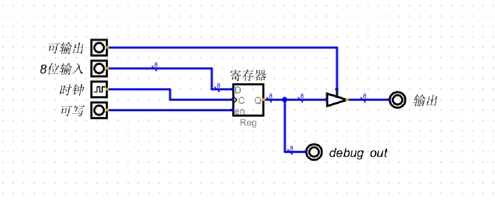
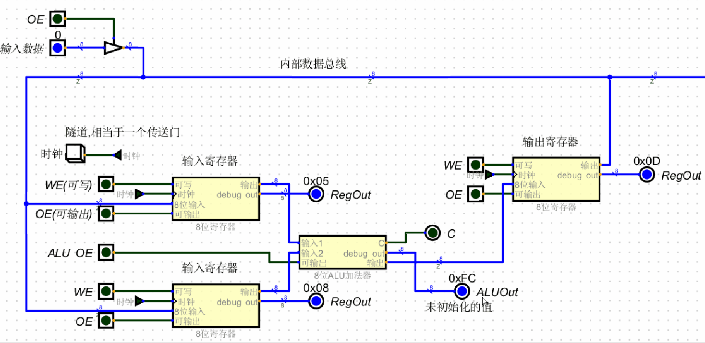
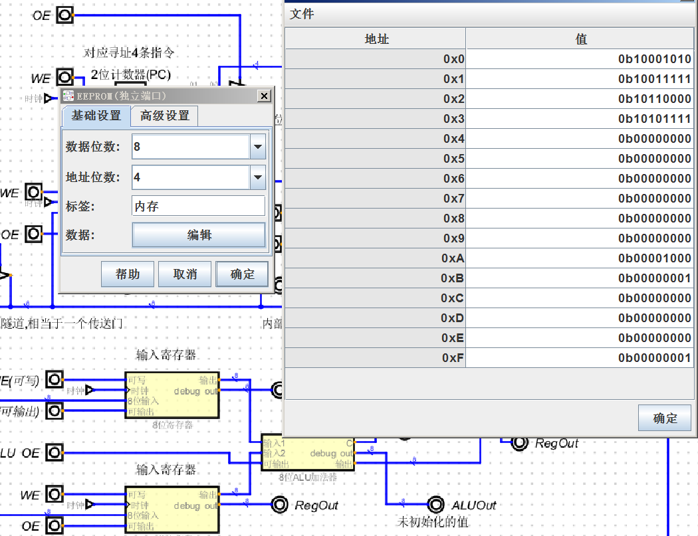

# 内部数据总线
+ 使用到的有8位寄存器(用于输入),4位寄存器(用于内存地址,只能寻址16个内存单元[2^4]),简化版加法ALU
+ 寄存器带了时钟, 由时钟统一控制操作
+ ALU不需要时钟, 输入端的寄存器由时钟控制

### 简化版加法ALU
+ 图上的C是进位,目前恒为零即可

### 4位寄存器,用于内存地址

### 8位寄存器,用于输入

## 总线图
+ 时钟使用按钮代替
+ 时钟用于让所有的电路自动工作,每触发一次,所有的相连的寄存器就工作一次
+ 总的来说时钟是一切电路自动化工作的源头
+ 古代碾磨需要一头牛来转圈,牛跑的越快碾磨速度越快, 振荡器速度越快,频率越高
+ 而时钟的取名我猜就是类似下一秒,时钟吼了一句"大家一起干活!",让所有的相连的电路同步工作
+ 时钟的另一个作用是编程中的术语来说就是同步
+  例如:
+  mov 寄存器B,0x99; 
+  mov 寄存器A, 寄存器B
+  寄存器B中的值有没有准备好? 什么时候能执行mov操作?
+  ip/Eip什么时候往下移动?
+  一旦有了时钟,就容易同步操作

## 从内存中读取指令
+ 为简化汇编指令, 这里只使用4条指令来演示, 自己模拟的汇编指令
+ 汇编指令一般都有 操作码 ,操作数 2个部分组成 
+ 操作码对应要做什么, 操作数对应要对这个数做什么操作,在这里操作数只能对内存地址寻址

|操作码|操作码二进制|解释|
|-|-|-|
|MOV_A|1000|复制数据到寄存器A|
|MOV_B|1001|复制数据到寄存器B|
|MOV_TO_ADDR|1010|复制寄存器C的数据到内存地址|
|ADD|1011|把寄存器A,B相加存放到寄存器C|

## 指令相关
+ 为简化指令,每个操作码固定占用4位,操作数也占用4位, 一个字节即可存放
+ 当前的寻址寄存器是4位,只能寻址16个地址线,因此对应操作数来说正好
+ 注意这里的操作数只能是内存地址

### 指令举例
|操作码|操作码二进制|操作数二进制|解释|内存数据|
|-|-|-|-|-|
|MOV_TO_ADDR|1010|0010|把寄存器C的数据复制到内存地址0010(0x02)|10100010|
|MOV_A|1000|1111|把内存地址0xF的数据复制到寄存器A|10001111|
|MOV_B|1001|1101|把地址0x0D的数据复制到寄存器B|10011101|
|ADD|1011|无|ADD没有操作数,固定只会寄存器A+B|10110000|

+ 下面内存中的4条指令是

|指令二进制|指令解释|
|-|-|
|10001010|把地址1010的数据加载到寄存器A|
|10011111|把地址1111的数据加载到寄存器B|
|10110000|ADD|
|10101111|把寄存器C的数据复制到地址1111处|

