# CPU内部结构
* [总线](#about_bus)
* [一些自定义部件](#alu_and_reg)
* [总线图](#bus_pic)
* [内存指令](#memery_in)
* [执行流程:取指令,译码,执行](#1)
* [pc做的事](#1.1)
* [内存地址寄存器](#1.2)
* [内存缓存寄存器](#1.3)
* [指令寄存器,译码第一步](#1.4)
* [指令寄存器传递地址到内存地址寄存器](#1.5)
* [指令MOV_A的过程(译码第二步)](#1.6)
* [第一条指令执行完毕](#1.7)
* [第三条指令的执行](#2)
* [第四条指令](#3)
* [第四条指令不同的执行流程](#3.1)
* [整体流程](#4)

<h3 id="about_bus">内部数据总线</h3>

+ 使用到的有8位寄存器(用于输入),4位寄存器(用于内存地址,只能寻址16个内存单元[2^4]),简化版加法ALU
+ 寄存器带了时钟, 由时钟统一控制操作
+ ALU不需要时钟, 输入端的寄存器由时钟控制
+ 总线就是一根根传送电信号的线 -_-
+ 内部的意思就是封装在CPU内部的 -_-
+ 外部总线就是主板上的 ^_^
+ 反正总线,就是一堆线
+ 但在任意时刻,只能由一个部件对其读/写,因此下面的所有部件都增加了 可写(WriteEnable) / 可读 (OutEnable,也可以叫可输出)
+ 在下面的图中有数据总线和地址总线,见名知意, 数据总线传送数据, 地址总线传送地址 ;- )
+ 注意,数据包含指令,都是二进制, 是数据还是指令由CPU本身去识别(x86,arm ....) 下面的汇编指令是我自己模拟的
+ 

### 下面有CPU整个执行流程,由于没有控制单元,因此纯手工操作

+
<h3 id="alu_and_reg">一些CPU内部需要用到的部件</h3>

### 简化版加法ALU
+ 图上的C是进位,目前恒为零即可

### 4位寄存器,用于内存地址

### 8位寄存器,用于输入

<h3 id="bus_pic">总线图</h3>

+ 时钟使用按钮代替
+ 时钟用于让所有的电路自动工作,每触发一次,所有的相连的寄存器就工作一次
+ 总的来说时钟是一切电路自动化工作的源头
+ 古代碾磨需要一头牛来转圈,牛跑的越快碾磨速度越快, 振荡器速度越快,频率越高
+ 而时钟的取名我猜就是类似 , 下一时刻时钟吼了一句"大家一起干活!"(脉冲信号),让所有的相连的电路一起干活
+ 时钟的另一个作用是编程中的术语来说就是同步
+  例如:
+  mov 寄存器B,0x99; 
+  mov 寄存器A, 寄存器B
+  寄存器B中的值有没有准备好? 什么时候能执行mov操作?
+  ip/Eip什么时候往下移动?
+  一旦有了时钟,就容易同步操作

<h3 id="memery_in">从内存中读取指令</h3>

+ 为简化汇编指令, 这里只使用4条指令来演示, 自己模拟的汇编指令
+ 汇编指令一般都有 操作码 ,操作数 2个部分组成 
+ 操作码对应要做什么, 操作数对应要对这个数做什么操作,在这里操作数只能对内存地址寻址

|操作码|操作码二进制|解释|
|-|-|-|
|MOV_A|1000|复制数据到寄存器A|
|MOV_B|1001|复制数据到寄存器B|
|MOV_TO_ADDR|1010|复制寄存器C的数据到内存地址|
|ADD|1011|把寄存器A,B相加存放到寄存器C|

## 指令相关
+ 为简化指令,每个操作码固定占用4位,操作数也占用4位, 一个字节即可存放
+ 操作码放高4位,操作数放低4位
+ 当前的寻址寄存器是4位,只能寻址16个地址线,因此对应操作数来说正好
+ 注意这里的操作数只能是内存地址

### 指令举例
|操作码|操作码二进制|操作数二进制|解释|内存数据|对应汇编伪指令|
|-|-|-|-|-|-|
|MOV_TO_ADDR|1010|0010|把寄存器C的数据复制到内存地址0010(0x02)|10100010| mov [0010], c
|MOV_A|1000|1111|把内存地址0xF的数据复制到寄存器A|10001111|mov a,[0x0f]|
|MOV_B|1001|1101|把地址0x0D的数据复制到寄存器B|10011101|mov b,[0x0D]|
|ADD|1011|无|ADD没有操作数,固定只会寄存器A+B,输出到寄存器C|10110000|add a,b; mov c,a|

+ 下面内存中的4条指令是

|指令二进制|指令解释|
|-|-|
|10001010|把地址1010的数据加载到寄存器A|
|10011111|把地址1111的数据加载到寄存器B|
|10110000|把寄存器A,B相加存放到寄存器C|
|10101111|把寄存器C的数据复制到地址1111处|

<h3 id="1"> 取指令,处理指令(译码),执行</h3>

+ 所涉及到的几个部件
+ PC: 程序位置计数器, 由于当前内存中只有4条指令,因此特意把PC设置成2位的计数器,0000 ~ 0011,但内存地址寄存器是4位的,所以把高2位设置成0
+ 内存地址寄存器 - MAR , 4位寄存器(最大寻址16字节)
+ CPU指令寄存器 - IR   , 8位寄存器
+ 内存缓存寄存器       , 8位寄存器
+ 外部内存 (外部是意思是 相对于 其他寄存器都是CPU内部的 ), 内存只有16字节
+ CPU数据外部总线和内部数据总线,地址总线这3根线的位宽取决于相连部件的输出,例如:
+ 1. PC输出的位宽是4位,内部地址总线位宽则是4
+ 2. 内存输出的位宽是8位, 外部数据总线的位宽是8
+ 下面分部说明每个部件要干的活
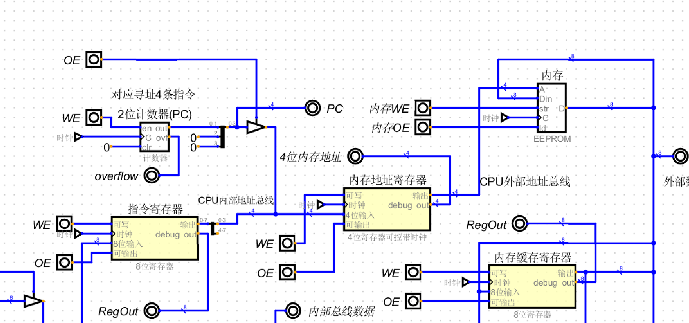
  
<h3 id= "1.1"> PC所做的事</h3>

+ 2位的计数器,因为内存中只有4条指令
+ 输出端连接CPU内部地址总线,传输到 内存地址寄存器
+ 但内存地址寄存器输入端是4位的,因此把PC的高2位置0
+ 告诉 内存地址寄存器, 当前需要去获取哪个位置(地址)
+ 
+ 当前PC的计数为0,因此传递过去也是0
+ 把当前计数器的位置输出到 内存地址寄存器
+ 把自身+1, PC 所存放的永远是下一条指令的位置
+ 
+ 如下图所示,一开始会打开PC的OE(out Enable), 打开内存地址寄存器的WE(Write Enable), 时钟一叫唤,他俩开始工作
+ 接下去, 关闭其他状态, 开启PC的WE, 时钟一叫, PC自身+1
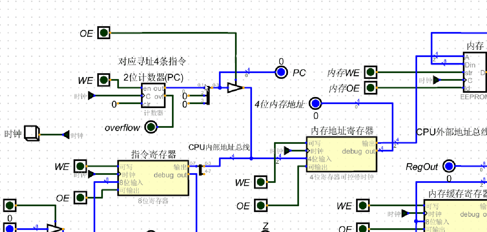

<h3 id = "1.2">内存地址寄存器</h3>

+ 此寄存器用于传递地址
+ 输入端连接CPU内部地址总线,输出端连接CPU外部地址总线, 总线连接到内存
+ 两种情况:
+ 1.把PC告诉自己的地址输出到CPU外部地址总线所相连的内存
+ 2.把指令寄存器输出的地址, 传输与CPU外部地址总线相连的内存(这一步下面的指令寄存器有说明)

<h3 id="1.3"> 内存缓存寄存器</h3>

+ 这个寄存器与CPU内部数据总线相连, 也跟外部数据总线相连
+ 这个内外相连的寄存器:
+ 1. 写入端: 外部数据总线能对其写入, 内部数据总线也能对其写入
+ 2. 输出端: 能输出到外部数据总线,也能输出到内部数据总线
+ 下图所示:
+ 1. 从内存地址寄存器(地址0000,此地址由PC传递过来) 通过地址总线传送到内存
+ 2. 内存把对应的二进制数据 通过 外部数据总线 传送到 内存缓存寄存器
+ 3. 此时,缓存寄存器有了数据,接着会把数据传递到指令寄存器
+ 4. 当前获取的内存地址:0000 中的二进制是10001010 => 16进制0x8A
+ 此二进制是一条汇编指令,上面说过

#### 通过内存地址寄存器传输到内存,内存输出到外部数据总线,再传输进内存缓存寄存器
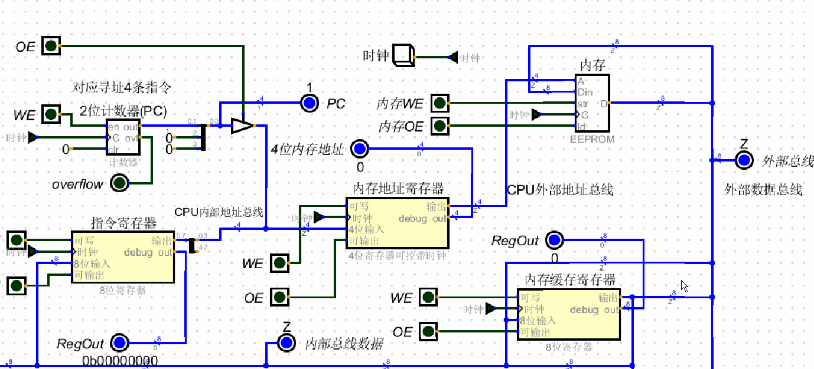
#### 内存缓存寄存器通过内部数据总线传输到指令寄存器
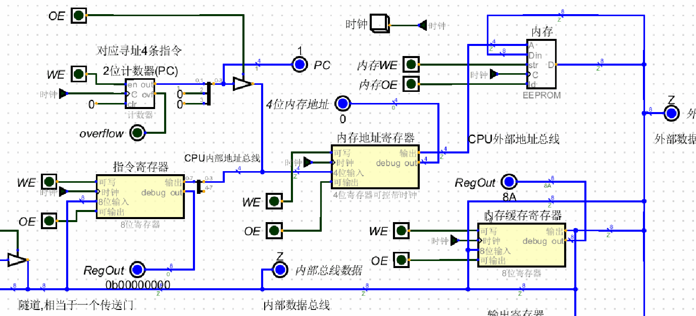

<h3 id = "1.4"> 指令寄存器</h3>

+ 上面说过, 内存缓存寄存器 同时连接外部数据总线和内部数据总线
+ 内存缓存寄存器 将把获取的数据传送到 指令寄存器
+ 此时 指令寄存器 内含的数据:0x8A(10001010)
+ 1. 10001010对应的指令是MOV_A:把1010地址的数据传送到寄存器A
+ 2. 高4位1000 是 自己模拟的汇编指令:MOV_A, 把数据复制到寄存器A的操作码
+ 3. 由于我自己模拟的汇编指令, 低4位都是需要从内存地址处获取数据(非立即数),因此将再次把低4位 1010 传递给 内存地址寄存器 
+ 一旦指令寄存器获取数据后,开始译码,这是一条MOV_A指令,后面低4位地址需要再次获取,因此将把低4位传送到内存地址寄存器
+ 下图所示,指令寄存器低4位(0-3位)输出到 CPU内部地址总线 进而 传递进 内存地址寄存器
#### 指令寄存器将低4位传送到内存地址寄存器
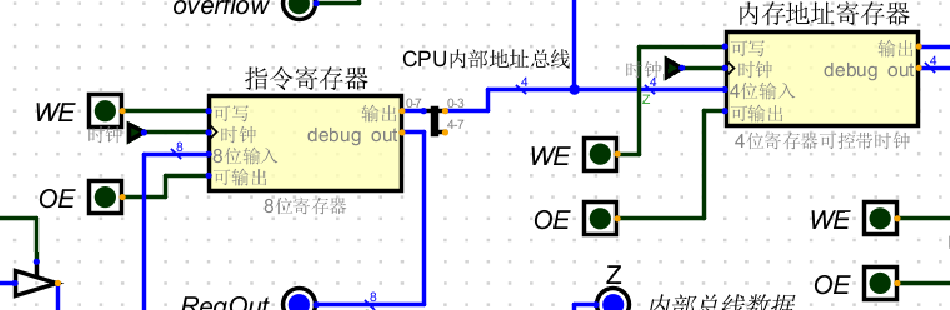
#### 传送动图
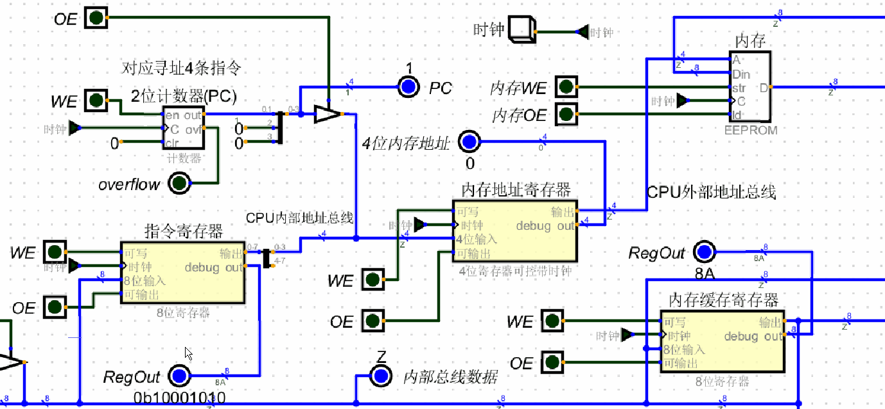

<h3 id = "1.5"> 回到内存地址寄存器,外部内存,内存缓存寄存器</h3>

+ 内存地址寄存器获取4位地址后再次通过外部地址总线传递到内存
+ 内存将此地址的1个字节的数据通过外部数据总线传送到 内存缓存寄存器
+ 内存缓存寄存器将又一次把数据通过 内部数据总线 传送到 指令寄存器
+ 1. 这次传送过程中, 内存地址寄存器将地址0x0A(1010)传送给内存
+ 2. 内存地址0x0A所存放的数据是:0x08
+ 3. 内存缓存寄存器此时还保留着上次的值:0x8A,经过外部数据总线传送进来后,数据变成了:0x08
#### 将指令寄存器传送的地址,传送到内存地址寄存器,通过外部地址总线,传送到内存,再通过外部数据总线传送到内存缓存寄存器 
#### 内存数据
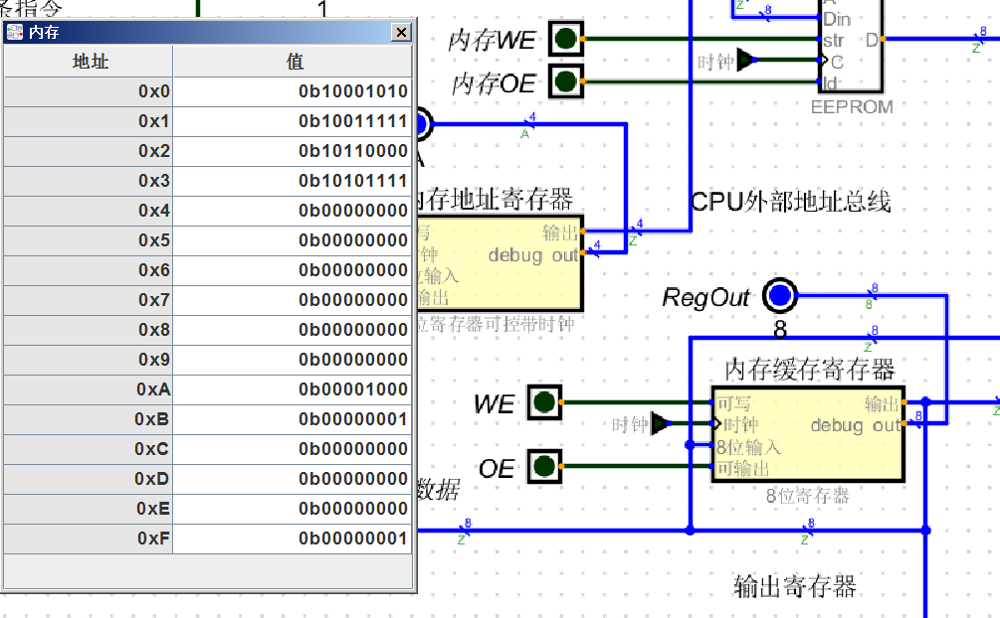
#### 数据传递动图
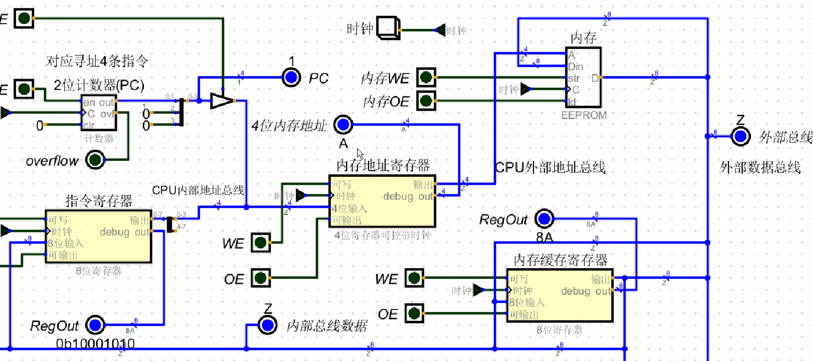

<h3 id="1.6"> 指令MOV_A的过程(译码)</h3>

+ 译码:根据指令,执行相对应的操作,在这就是需要把数据复制到寄存器A
+ 根据上面流程, 此时 指令寄存器的高位 1000, 对应MOV_A, 地址:1010 对应的内存数据也传送到 内存缓存寄存器中
+ 接下来就要开始执行指令了,把 内存缓存寄存器的数据通过内部数据总线传送到 寄存器A 中
+ 注:内存缓存寄存器的输出端连接内部数据总线,也连接外部数据总线
#### 内存缓存寄存器的数据传递到寄存器A
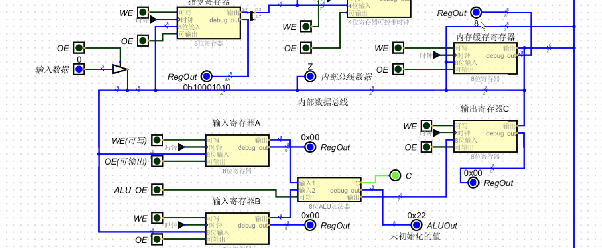

<h3 id="1.7"> 到此内存中的第一条指令执行完毕 </h3>

|内存地址|指令二进制|指令解释|执行完成|
|-|-|-|-|
|0x00|10001010|把地址1010的数据加载到寄存器A|Yes|
|0x01|10011111|把地址1111的数据加载到寄存器B|No|
|0x02|10110000|ADD|NO|
|0x03|10101111|把寄存器C的数据复制到地址1111处|NO|
+ 第二条指令与第一条指令类似,除了内存地址和寄存器不同,其他一致
+ 这里就省略第二条指令的执行流程

<h3 id="2"> 开始第三条指令的执行</h3>

+ 先回忆下前面的流程, 第一条指令执行完后PC的值:1
+ PC的特性是:永远指向下条指令位置
+ 第二条指令开始时
+ 1. 先把PC传送到内存地址寄存器
+ 2. 然后PC自身+1, 此时PC的值:2
+ 3. 省略其他流程
+ 4. 地址1111(0x0f)的数据是0x01.因此寄存器B的数据是:0x01
+ 当第二条指令执行完毕后PC的值:2,也就是指向了第三条指令: 10110000 => ADD
+ 第三条指令简述步骤: 
+ 1. PC输出-> 内存地址寄存器 -> PC +1
+ 2. 内存地址寄存器 -> 内存 -> 写入内存缓存寄存器
+ 3. 内存缓存寄存器 -> 指令寄存器
+ 4. 指令寄存器开始译码
+ 5. 译码:此时这是一条ADD指令,不需要再去传送地址,直接让寄存器A,寄存器B 传送到 8位ALU加法器 中
+ 6. 最后ALU输出的结果存放到寄存器C中
+ 
#### 下图是执行完第二条指令的状态图
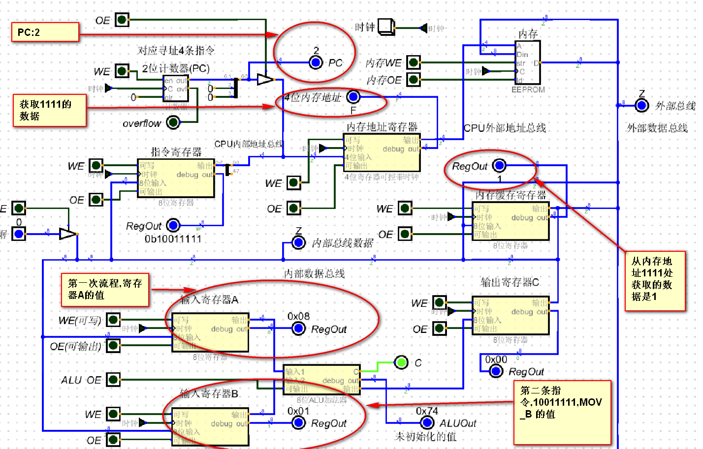

#### 执行第三条指令,直到指令被放入指令寄存器中
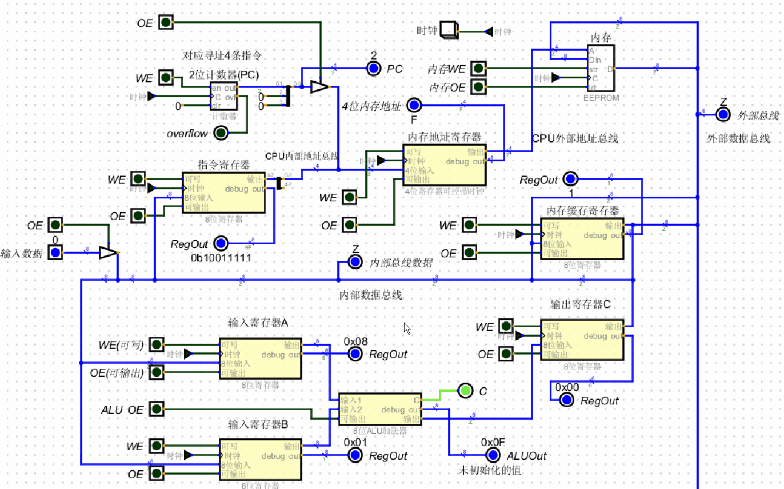

#### 指令寄存器开始译码并执行
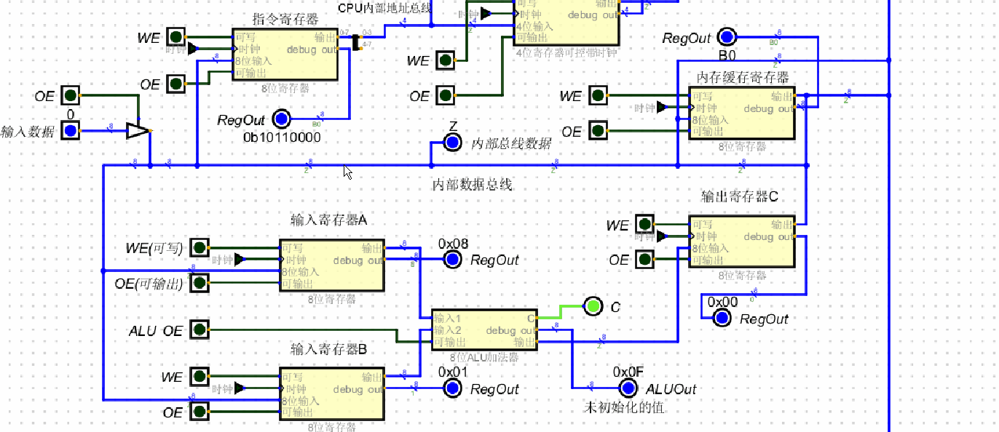

<h3 id="3">开始第四条指令</h3>

+ 第四条指令简述步骤:
+ 0. 这条指令后,PC将回归0, 意味着这条指令执行完后,又会重新回到第一条指令
+ 1. PC->内存地址寄存器 -> PC+1(溢出,PC此时又回到了0,PC是2位寄存器)
+ 2. 内存地址寄存器 -> 内存 -> 内存缓存寄存器
+ 3. 内存缓存寄存器 -> 指令寄存器
+ 5. 这是一条MOV_TO_ADDR指令:10101111(0xAF)
+ 6. 指令寄存器开始译码
+ 7. 译码:这是一条把寄存器C复制到内存地址的指令
+ 
#### 下图是执行第四条指令,直到指令被传送到指令寄存器中
  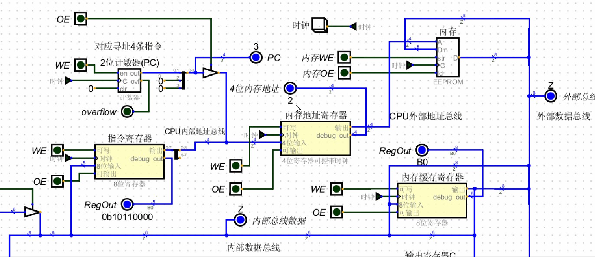

<h3 id = "3.1">第四条指令的不同</h3>

+ 1. 这和之前的指令都不一样,之前的指令是读取内存,现在需要写内存
+ 2. 不仅需要指定内存地址,也需要把数据准备好,指定在哪个地址上写什么数据
+ 3. 内存缓存寄存器 即连接内部数据总线,也连接外部数据总线,因此需要把寄存器C的数据输出到 内存缓存寄存器中
+ 4. 对于内存地址的指定,就需要依靠由 指令寄存器分离的低4位传递到 内存地址寄存器中
+ 5. 需要准备好的寄存器有: 寄存器C, 内存缓存寄存器,指令寄存器, 内存地址寄存器
+ 6. 数据: 通过寄存器C 传递到内存缓存寄存器; 
+ 7. 地址: 通过指令寄存器分离的低4位,传递到内存地址寄存器
+ 8. 在数据和地址准备好后, 写入进: 内存缓存寄存器,内存地址寄存器, 下图1
+ 9. 此时有了数据和地址, 需要再次往内存写入地址和数据,下图2
+ 10. 往内存写完后,又会循环到第一条指令(PC=0)

#### 图1. 把数据和地址分别传送给内存地址寄存器,内存缓存寄存器
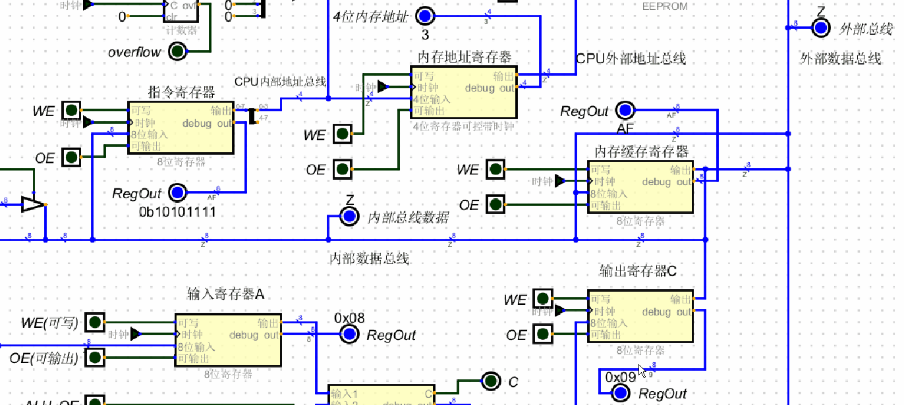
  
#### 图2. 把内存缓存寄存器和内存地址寄存器的数据写入内存
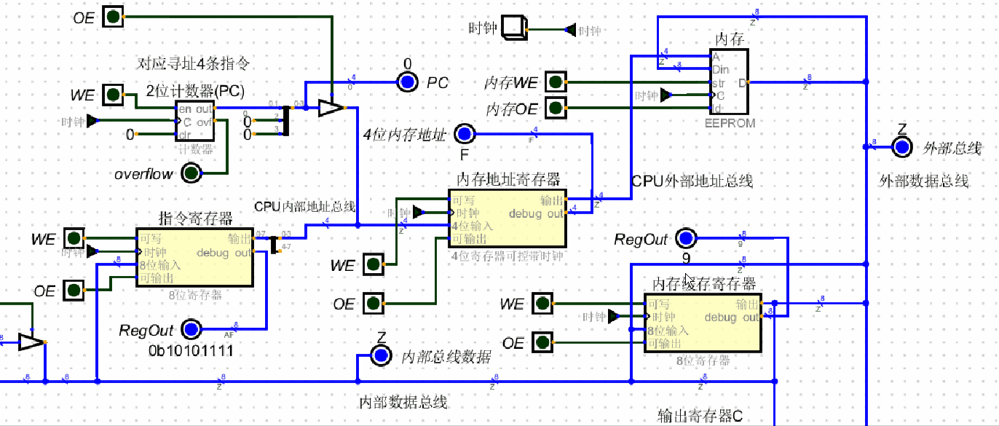

<h3 id = "4"> 整体流程,全程手动,老夫累了</h3>

+ 0.step 0 , PC
+ 1. 清空状态(把其他开关全关了)
+ 2. 打开PC OE, 打开 内存地址寄存器 WE
+ 3. PC 输出位置(2位) 到 内存地址寄存器
+ 4. 清空状态
+ 5. 打开 PC WE, PC自身加1 (永远指向下一条位置)
+ 
+ 1.step 1,内存地址寄存器传送地址,内存缓存寄存器获取数据
+ 1. 清空状态
+ 2. 打开 内存地址寄存器 OE, 打开 内存缓存寄存器 WE, 打开 内存 OE
+ 3. 通过 内存地址寄存器 传输地址到内存
+ 4. 内存收到的地址把此地址的一个字节(二进制不分[数据,指令])通过外部数据总线 传输到 内存缓存寄存器
+ 
+ 2.step 2, 内存缓存寄存器把数据传送到指令寄存器
+ 1. 清空状态
+ 2. 打开内存缓存寄存器OE,打开指令寄存器WE,时钟一吼,立即传送到位
+ 
+ 3.step 3,指令寄存器干活
+ 1. 清空状态
+ 2. 开始译码
+ 3. 拆分1个字节,高4位操作码,低4位操作数(内存地址)
+ 4. 如果操作码是ADD,则跳转到step 7
+ 5. 如果操作码是MOV_TO_ADDR,跳转到step 8
+ 6. 如果操作码是MOV_A,MOV_B则往下执行
+ 7. 把低4位的地址传送到 内存地址寄存器
+ 8. 打开内存地址寄存器WE,打开 指令寄存器OE,时钟一吼,低4位的地址就传送到了 内存地址寄存器
+ 
+ 4.step 4, 执行一次step 1, 传递地址获取内存数据
+ 1. 执行一次step 1,此时 内存缓存寄存器中有了数据
+ 2. 这个时候根据指令本身来执行(译码),此时指令寄存器中的指令是1000,即MOV_A,因此需要把数据传送到寄存器A
+ 
+ 5.step 5, 把数据传送到寄存器A
+ 1. 清空状态
+ 2. 打开 内存缓存寄存器的OE, 打开寄存器A的WE,时钟脉冲一到, 一个字节的数据通过 CPU内部数据总线传送到了寄存器A,一条指令执行完毕
+ 
+ 6.step 6, 回到step 0
+ 
+ 7.step 7, 执行ADD
+ 1. 清空状态
+ 2. 打开寄存器A,寄存器B的OE,打开ALU的OE,打开寄存器C的WE, 时钟一到, A+B的结果就被存放在了寄存器C
+ 3. ADD执行完毕,回到step 0
+ 
+ 8.step 8, 执行MOV_TO_ADDR
+ 1. 清空状态
+ 2. 准备好数据与地址,打开指令寄存器OE,打开内存地址寄存器WE,打开寄存器C的OE, 打开内存缓存寄存器的WE,时钟一喊, 地址和数据都准备完成
+ 3. 清空状态
+ 4. 打开 内存地址寄存器OE, 打开 内存缓存寄存器OE,打开 内存WE (往内存的某个地址上写数据) 
+ 5. 至此最后一条指令执行完毕
+ 6. 再次回到step 0, 此时PC:0,因此将循环往复的从头执行
