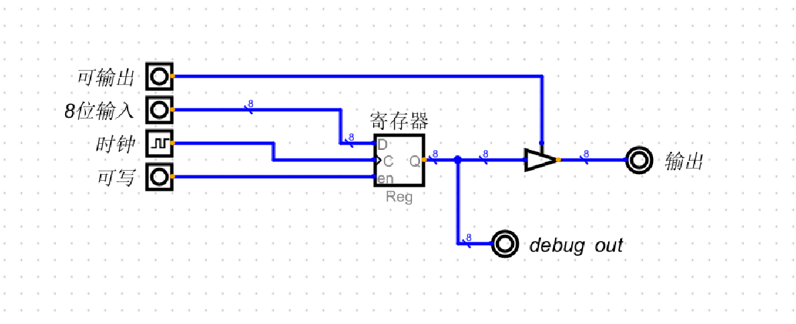

# 内部数据总线
+ 使用到的有8位寄存器(用于输入),4位寄存器(用于内存地址,只能寻址16个内存单元[2^4]),简化版加法ALU
+ 寄存器带了时钟, 由时钟统一控制操作
+ ALU不需要时钟, 输入端的寄存器由时钟控制

### 简化版加法ALU
+ 图上的C是进位,目前恒为零即可

### 4位寄存器,用于内存地址

### 8位寄存器,用于输入

## 总线图
+ 时钟使用按钮代替
+ 时钟用于让所有的电路自动工作,每触发一次,所有的相连的寄存器就工作一次
+ 总的来说时钟是一切电路自动化工作的源头
+ 古代碾磨需要一头牛来转圈,牛跑的越快碾磨速度越快, 振荡器速度越快,频率越高
+ 而时钟的取名我猜就是类似下一秒,时钟吼了一句"大家一起干活!",让所有的相连的电路同步工作
+ 时钟的另一个作用是编程中的术语来说就是同步
+  例如:
+  mov 寄存器B,0x99; 
+  mov 寄存器A, 寄存器B
+  寄存器B中的值有没有准备好? 什么时候能执行mov操作?
+  ip/Eip什么时候往下移动?
+  一旦有了时钟,就容易同步操作

