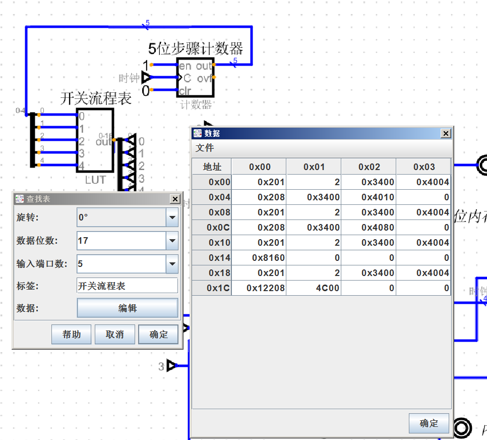
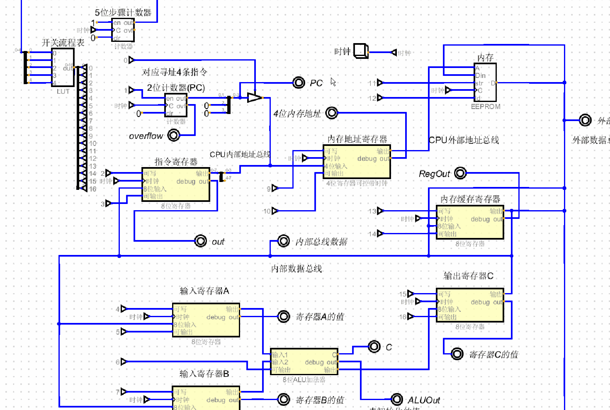
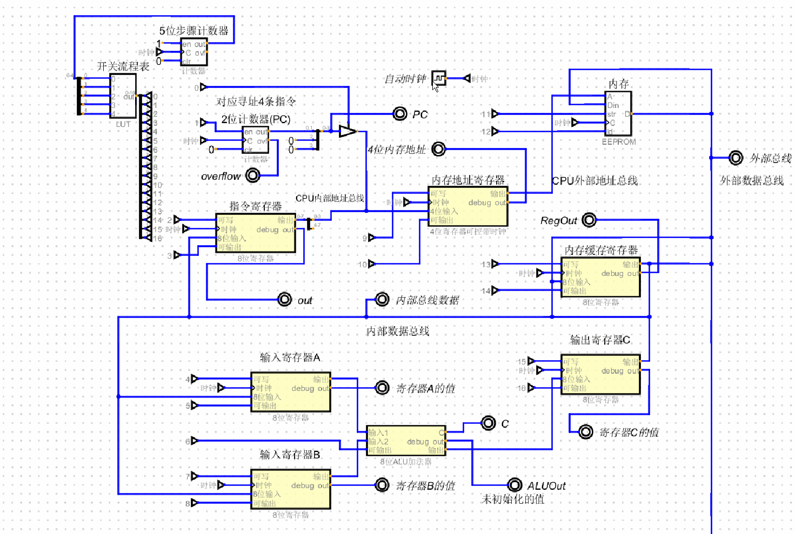

# CPU的自动化
* [改造1-使用2进制导线](#1)
* [改造2](#2)
* [根据整体流程开始改造](#2.1)
* [指令分析](#2.2)
* [指令MOV_A的开关2进制表格](#2.3)
* [手动时钟gif](#2.4)
* [自动时钟gif](#2.5)
* 
## 根据之前的CPU内部结构改造,制造一个cpu控制单元

<h3 id="1">改造一</h3>

+ 之前的CPU全由手动开关自己控制,极度繁琐,而开关能跟二进制一一对应, 开:1, 关:0
+ 图1是之前的, 图2是改造后的,图3是改造后的近景图
+ 把之前 WE,OE开关 全部替换成 能用二进制控制的导线
+ 近景图可以看到改造后的WE,OE使用的导线都被编号了
+ 例如: PC的WE:1号,OE:0号, 指令寄存器的WE:2号,OE:3号
+ 与左边的二进制开关编号一一对应
+ 这样,假设 PC给内存地址寄存器传值的话,也就是开启PC的OE,开启内存地址寄存器的WE,只需要在二进制开关上的第9位,和第0位 置1即可
+ 效果图4: 模拟PC给内存地址寄存器传值
+ 

### 图1 之前的

+ 

### 图2 改造后的

+ 

### 图3 近景图

+ 

### 图4 模拟PC计数器 给 内存地址寄存器传值

<h3 id ="2">改造二:</h3>

+ 上述的改造还需要手动输入二进制,才能实现自动化,因此继续改造
+ 根据之前写的整体流程,这里复制过来一份:
+ 需要把这些流程全部替换成二进制(控制他们的开关)

+ 0.step 0 , PC
+ 1. 清空状态(把其他开关全关了)
+ 2. 打开PC OE, 打开 内存地址寄存器 WE
+ 3. PC 输出位置(2位) 到 内存地址寄存器
+ 4. 清空状态
+ 5. 打开 PC WE, PC自身加1 (永远指向下一条位置)
+ 
+ 1.step 1,内存地址寄存器传送地址,内存缓存寄存器获取数据
+ 1. 清空状态
+ 2. 打开 内存地址寄存器 OE, 打开 内存缓存寄存器 WE, 打开 内存 OE
+ 3. 通过 内存地址寄存器 传输地址到内存
+ 4. 内存收到的地址把此地址的一个字节(二进制不分[数据,指令])通过外部数据总线 传输到 内存缓存寄存器
+ 
+ 2.step 2, 内存缓存寄存器把数据传送到指令寄存器
+ 1. 清空状态
+ 2. 打开内存缓存寄存器OE,打开指令寄存器WE,时钟一吼,立即传送到位
+ 
+ 3.step 3,指令寄存器干活
+ 1. 清空状态
+ 2. 开始译码
+ 3. 拆分1个字节,高4位操作码,低4位操作数(内存地址)
+ 4. 如果操作码是ADD,则跳转到step 7
+ 5. 如果操作码是MOV_TO_ADDR,跳转到step 8
+ 6. 如果操作码是MOV_A,MOV_B则往下执行
+ 7. 把低4位的地址传送到 内存地址寄存器
+ 8. 打开内存地址寄存器WE,打开 指令寄存器OE,时钟一吼,低4位的地址就传送到了 内存地址寄存器
+ 
+ 4.step 4, 执行一次step 1, 传递地址获取内存数据
+ 1. 执行一次step 1,此时 内存缓存寄存器中有了数据
+ 2. 这个时候根据指令本身来执行(译码),此时指令寄存器中的指令是1000,即MOV_A,因此需要把数据传送到寄存器A
+ 
+ 5.step 5, 把数据传送到寄存器A
+ 1. 清空状态
+ 2. 打开 内存缓存寄存器的OE, 打开寄存器A的WE,时钟脉冲一到, 一个字节的数据通过 CPU内部数据总线传送到了寄存器A,一条指令执行完毕
+ 
+ 6.step 6, 回到step 0
+ 
+ 7.step 7, 执行ADD
+ 1. 清空状态
+ 2. 打开寄存器A,寄存器B的OE,打开ALU的OE,打开寄存器C的WE, 时钟一到, A+B的结果就被存放在了寄存器C
+ 3. ADD执行完毕,回到step 0
+ 
+ 8.step 8, 执行MOV_TO_ADDR
+ 1. 清空状态
+ 2. 准备好数据与地址,打开指令寄存器OE,打开内存地址寄存器WE,打开寄存器C的OE, 打开内存缓存寄存器的WE,时钟一喊, 地址和数据都准备完成
+ 3. 清空状态
+ 4. 打开 内存地址寄存器OE, 打开 内存缓存寄存器OE,打开 内存WE (往内存的某个地址上写数据) 
+ 5. 至此最后一条指令执行完毕
+ 6. 再次回到step 0, 此时PC:0,因此将循环往复的从头执行

<h3 id="2.1">根据整体流程开始改造</h3>

+ 一共17个开关,也就是17个1,0的二进制,我这里就不在前面补0了. 这里的流程与上面一一对应
> MOV_A(1000)的流程:
+ 0.step 0
+ 1. 1000000001
+ 2. 10         (这一步需要额外多算一步,这里只是为了对应上面的流程)
+ 1.step 1
+ 1. 11010000000000
+ 2.step 2
+ 1. 100000000000100
+ 3.step 3
+ 1. 1000001000
+ 4.step 4
+ 1. 11010000000000
+ 5.step 5
+ 1. 100000000010000
+ 
> MOV_B(1001)的流程,与MOV_A的流程除了step 5不一样,其他都一样:
+ 5.step 5
+ 1. 100000010000000
> ADD(1011)流程: step 0 ~ step 2都一样:
+ 3.step 3
+ 1. 1000000101100000
> MOV_TO_ADDR(1010) 流程: step 0 ~ step 2一样
+ 1. 10010001000001000
+ 2. 100110000000000

<h3 id="2.2">指令分析流程</h3>

+ 根据上面已经可以得到所有的开关2进制流程
+ 类似内存单元中的2进制表来控制每个内存单元,但内存单元中的表还是需要手动输入
+ 想要让这张表自动执行,需要一个由时钟控制的计数器
+ 这个计数器的值,相当于地址,每次+1,地址就+1
+ 根据上面的流程可知一共需要25组2进制,也就意味着需要25个地址,每个地址需要17位的数据,而查找表根据2的N次方来产生地址表,因此,需要2^5,相当于5位二进制
+ 同时需要一个5位的计数器,对应查找表的5位地址
+ 1. 建立一张查找表,存放对应的地址(5位)和数据(17位),图1
+ 2. 5位的计数器,根据计数器每次+1来,找到对应查找表的地址, 执行相应的开关2进制
+ 3. 每次时钟一吼, 5位计数器就得到响应,立马把地址传递到查找表, 查找表根据对应地址的数据输出开关2进制(图2)
+ 4. 使用自动的实时时钟,10赫兹,图3
+ 5. 10赫兹:一秒钟执行10组高低电频,MOV_A指令有7组,一秒大概能执行到MOV_B的step 1
+ 

<h3 id="2.3">表格举例(MOV_A指令)</h3>

| 二进制开关指令(17位)|对应step|
|-|-|
|1000000001|step 0 中的1|
|10|step 0 中的2|
|11010000000000|step 1|
|100000000000100|step 2|
|1000001000|step 3|
|11010000000000|step 4|
|100000000010000|step 5|

### 图1,根据上面表格的示例,创建一张地址5位,数据17位的查找表(专门用于地址-数据查询)

+ 其余为0的数据就是清空状态(只是为了补齐地址,让每一条指令在开头,仅仅是看起来方便)
+ MOV_A所在的起始位置:
+ 1. 0x00:0x00 这个起始位置的指令就是 1000000001 (step 0)
+ 2. 0x04:0x02 (也就是地址0x07)是这条指令的最后的操作:100000000010000(0x4010)
+ MOV_B的起始位置:0x08:0x00 (地址0x08)
+ ADD起始位置:0x10:0x00 (地址0x10)
+ MOV_TO_ADDR的起始位置:0x18:0x00 (地址0x18)
+ 

<h3 id="2.4">图2, 计数器根据时钟来自动+1, 并输出到查找表中,查找表根据地址,输出对应的开关2进制,这里的时钟依旧使用手点</h3>

+ 

<h3 id="2.5"> 图3,全自动,使用自动时钟(使用10赫兹的实时时钟) </h3>

+ 

