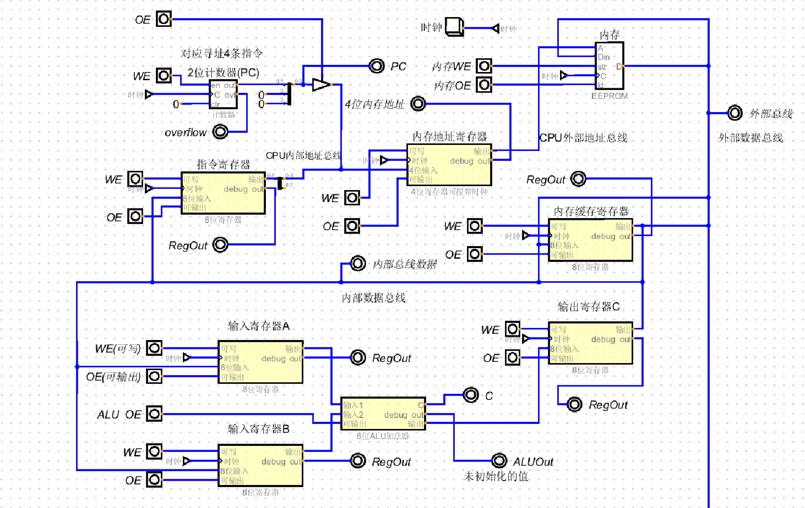
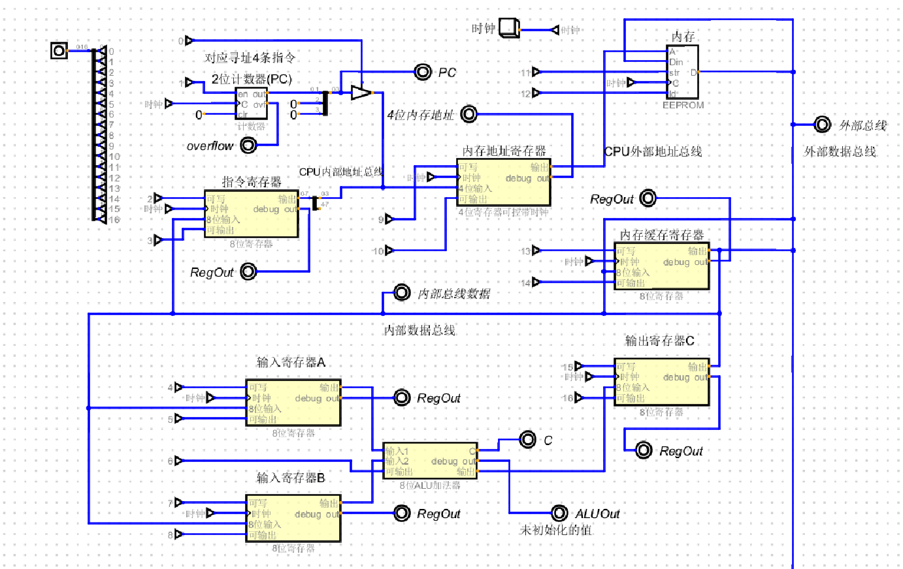
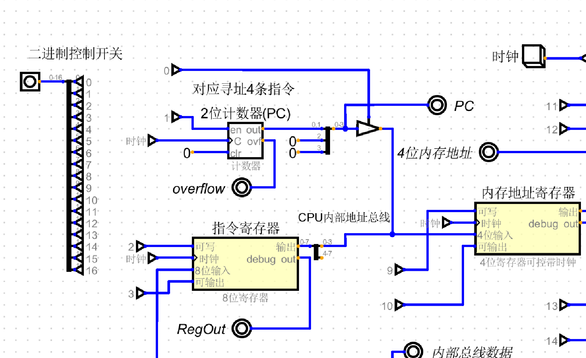
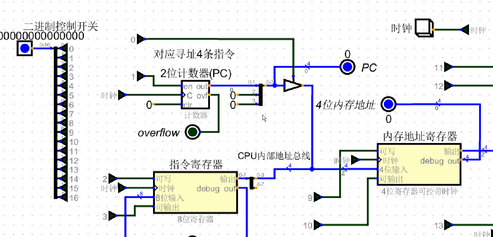

# CPU的自动化
* [自动化改造-通过2进制导线](#first_step)
* [改造2-](#sec_step)
## 根据之前的CPU内部结构改造,制造一个cpu控制单元

<h3 id="first_step">改造一</h3>

+ 之前的CPU全由手动开关自己控制,极度繁琐,而开关能跟二进制一一对应, 开:1, 关:0
+ 图1是之前的, 图2是改造后的,图3是改造后的近景图
+ 把之前 WE,OE开关 全部替换成 能用二进制控制的导线
+ 近景图可以看到改造后的WE,OE使用的导线都被编号了
+ 例如: PC的WE:1号,OE:0号, 指令寄存器的WE:2号,OE:3号
+ 与左边的二进制开关一一对应
+ 这样,如果执行之前的PC给内存地址寄存器传值的话,也就是开启PC的OE,开启内存地址寄存器的WE,只需要在二进制开关上的第9位,和第0位 置1即可
+ 效果图4: 模拟PC给内存地址寄存器传值
+ 

### 图1 之前的

+ 
### 图2 改造后的

+ 
### 图3 近景图

+ 
### 图4 模拟PC计数器 给 内存地址寄存器传值

<h3 id ="sec_step">改造二:</h3>
+ 上述的改造还需要手动输入二进制,才能实现自动化,因此继续改造
+ 根据之前写的整体流程
